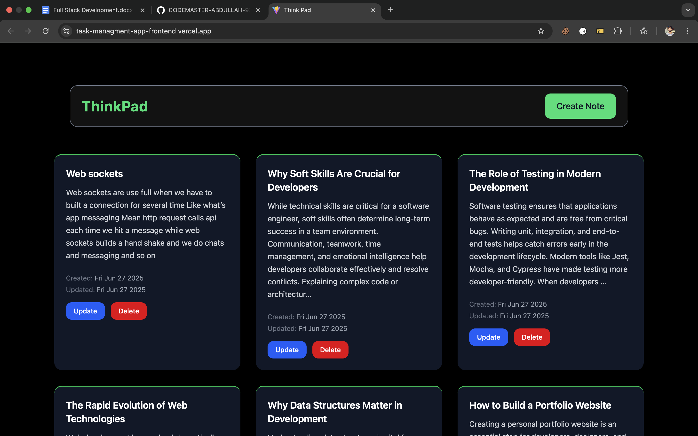
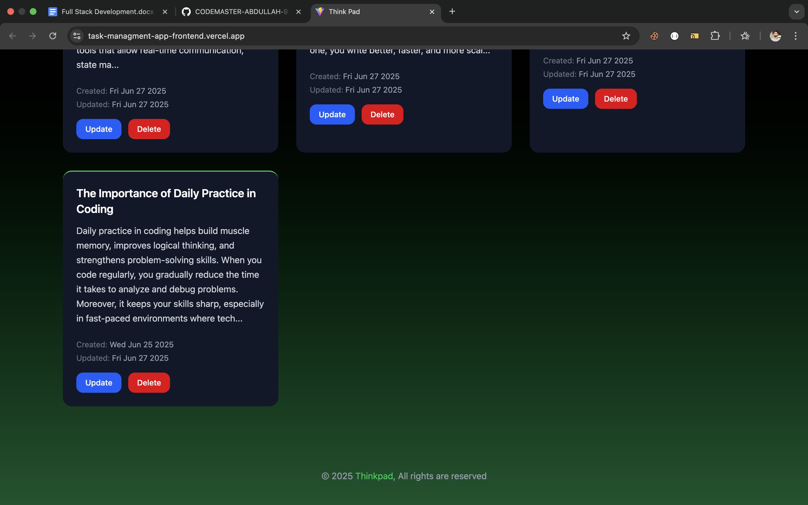

# 📋 TaskFlow – MERN Stack Task Management App

TaskFlow is a full-featured Task Management Application built with the MERN Stack (MongoDB, Express.js, React.js, Node.js). It allows users to create, update, delete, and manage their tasks efficiently. The app includes user authentication, task categorization, status filters, and a responsive UI.

---

## 🚀 Features

- ✅ User Authentication (Register/Login with JWT)
- 📝 Create, Read, Update, and Delete Tasks
- 📌 Task Prioritization (High, Medium, Low)
- 📅 Due Dates and Status Tracking (Pending, In Progress, Completed)
- 🔍 Filter & Search Tasks
- 🎨 Responsive and Modern UI with Tailwind CSS
- 🔐 Protected Routes for Authenticated Users
- 📦 RESTful API Integration

---

## 🖼️ Screenshots
### 🔐 Login Page

### 📋 Task Dashboard

---

## 🧰 Tech Stack

**Frontend**  
- React.js  
- Tailwind CSS  
- Axios  
- React Router DOM  
- Context API or Redux (optional)

**Backend**  
- Node.js  
- Express.js  
- MongoDB with Mongoose  
- JSON Web Token (JWT)  
- bcryptjs for password hashing  
- dotenv for environment variables

---
